# 🎡 碎碎唸

1. AdorAirDuct
1. 鐵力士腳架
1. 攝影機腳座
1. XL多段升降桌 
1. DoorLock 碎碎唸

## 🎡 240922 AdorAirDuct 碎碎唸
一切就從 Ador 排氣孔開始, 不過是印個排氣孔, 為什麼買了 AC Kobra 3 combo, 
之後又買了一台 Bambu A1 mini combo, 在印了24hr之後, 原本完美列印的 Kobra3 就消極
怠工, 印了16hr開始發泡了, 整台該拆的都拆了, 該試的都試了, 最後換了新的噴嘴, 總算回神了。
(哇靠 噴嘴用不到三天就印壞了!? 先是ACE堵料, 很不幸的堵在緩沖機前面, 
把ACE全拆了才能拿出堵料, 然後噴嘴壞了, 又然後改 A1 mini 印也堵, 
才發現室內濕度接近90%, 線料放在ACE裏面還是受潮了, 就這一個月該過的崁都過了吧!)

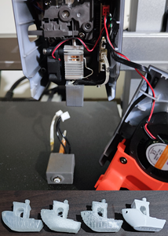

離第1台3DP也過去八年了, 全民3D列印的時代真的快來臨了, 全民全彩3D列印時代也快到了, 
九月看到多色列印機, 立馬就下單了, 本來是要買拓竹的 X1 Combo, 嫌購買太麻煩, 
就陰錯陽差買了價格只有1/4看起來CP值很高的 AnyCubic Kobra 3, 
就這2款多色3DP, 一堆YT超推拓竹真不是推假的, 操作就真的很親民, 
雖然需排除的狀況一個也沒少, 整體設計就是簡單易用, 同樣堵料清除, ACE 真的很麻煩。
雖然沒有買拓竹的 AMS, 在近乎一個月的撞牆, 對箱型 ACE/AMS 已經有了恐懼症, 
就買了 AMS Lite, 不是箱型設計, 清堵料容易多了, 連印 TPU 都沒堵, 不過 TPU 太軟, 
換料推不動, 所以退料一定要清噴嘴, 也就是拆下噴嘴, 拔掉TPU再裝回去就完事了。
不過拓竹的 AMS 設計相對於 AnyCubic ACE 來說, 雖然排除堵料還是要拆機, 
有比較直觀些, 設計上比較不容易堵料, AMS 當初沒有採用 Prusa MMU2S 進料路徑, 
而是用更傳統的單線進料結構, 也是很有先見之明。

切片軟體 Bambu Studio 一樣源自 PrusaSlicer, 直接上 Calibration 真的還蠻上心滴, 
校正上表現很優秀, 列印中斷續印的表現也很優, 這也是 Anycubic Slicer 比不上的, 
不過 Bambu Studio 不給印修改過的 GCode, 無法印溫度塔, 還蠻遺憾滴。
正常列印狀況下 AC Kobra 3 印的比 A1 mini 更細緻更美, 懸臂支撐還是稍有差距, 光澤度也不如 Kobra3。
但對小白來說, Kobra 3 combo 挑戰度真的很高, 狀況排除不易, 
不過 ACE 也才上市沒多久, 韌體還有些問題, 有意入手的小白可能要再等等, 
問題才能趨於穩定, 不然就是要有拆機的心理準備, 就容易和不容易的差別。

## 🎡 241010 鐵力士腳架碎碎唸
TPU 底座210℃/205℃ 這列印品質絕了。

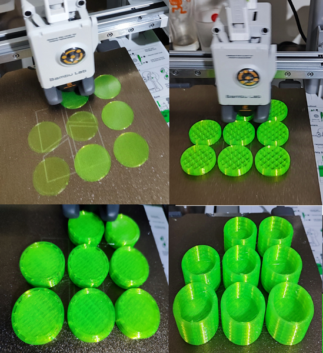

## 🎡 241024 攝影機腳座碎碎唸

PETG 碳纖維 攝影機腳座, PLA 好看多了, 可惜不耐風吹雨打。

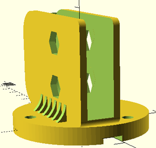
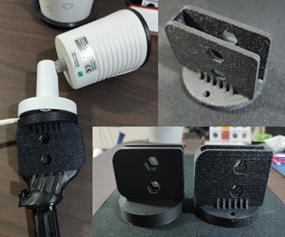

## 🎡 241029 XL多段升降桌碎碎唸
在嘖嘖集資踩了超多雷滴, 連百年品牌都能搞飛機 實在無言,
XL多段升降桌是少數粉貴但貴的好用的集資專案。

螢幕角度調整座 16.7° (24mm-80mm-80mm), 內裏的預設支撐超級難拆, 所以就只加了外圍樹狀支撐, 列印品質也還不錯~
PLA 會跑位, 又印了一版 TPU, 不曉得為何一樣的列印檔, 列印時間會多出一半, 也就印的超漂亮滴, 可惜太軟不適合支撐, 就在 PLA 下面墊了塊海棉就行。

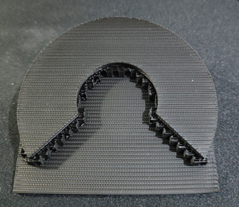
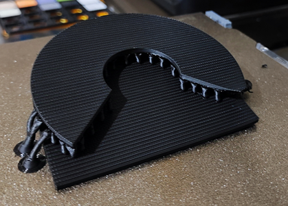
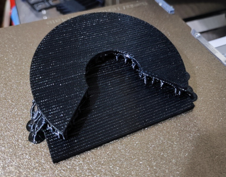
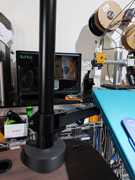

## 🎡 241103 DoorLock 碎碎唸

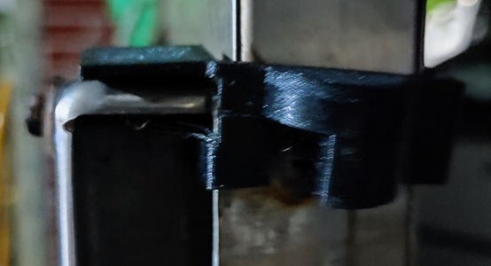
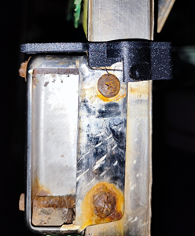
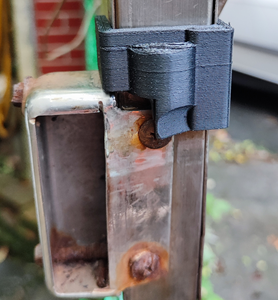
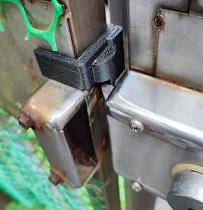
