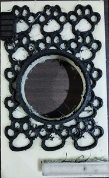

# 🎡 碎碎唸 | 🎡 Kobra3 指南 | 🎡 A1 指南 | 🎡 AC Kobra 3 必印 | 🎡 Bambu A1 mini 必印

## 🎡 240922 AdorAirDuct 碎碎唸
一切就從 Ador 排氣孔開始, 不過是印個排氣孔, 為什麼買了 AC Kobra 3 combo, 
之後又買了一台 Bambu A1 mini combo, 在印了24hr之後, 原本完美列印的 Kobra3 就消極
怠工, 印了16hr開始發泡了, 整台該拆的都拆了, 該試的都試了, 最後換了新的噴嘴, 總算回神了。
(哇靠 噴嘴用不到三天就印壞了!? 先是ACE堵料, 很不幸的堵在緩沖機前面, 
把ACE全拆了才能拿出堵料, 然後噴嘴壞了, 又然後改 A1 mini 印也堵, 
才發現室內濕度接近90%, 線料放在ACE裏面還是受潮了, 就這一個月該過的崁都過了吧!)

離第1台3DP也過去八年了, 全民3D列印的時代真的快來臨了, 全彩3D列印時代也快到了, 
九月看到多色列印機, 立馬就下單了, 本來是要買拓竹的 X1 Combo, 嫌購買太麻煩, 
就陰錯陽差買了價格只有1/4看起來CP值很高的 AnyCubic Kobra 3, 
就這2款多色3DP, 一堆YT超推拓竹真不是推假的, 操作就真的很親民, 
雖然需排除的狀況一個也沒少, 整體設計就是簡單易用, 同樣堵料清除, ACE 真的很麻煩。
雖然沒有買拓竹的 AMS, 在近乎一個月的撞牆, 對箱型 ACE/AMS 已經有了恐懼症, 
就買了 AMS Lite, 不是箱型設計, 清堵料容易多了, 連印 TPU 都沒堵, 不過 TPU 太軟, 
換料推不動, 所以退料一定要清噴嘴, 也就是拆下噴嘴, 拔掉TPU再裝回去就完事了。
不過拓竹的 AMS 設計相對於 AnyCubic ACE 來說, 雖然排除堵料還是要拆機, 
有比較直觀些, 設計上比較不容易堵料, AMS 當初沒有採用 Prusa MMU2S 進料路徑, 
而是用更傳統的單線進料結構, 也是很有先見之明。

切片軟體 Bambu Studio 一樣源自 PrusaSlicer, 直接上 Calibration 真的還蠻上心滴, 
校正上表現很優秀, 列印中斷續印的表現也很優, 這也是 Anycubic Slicer 比不上的, 
不過 Bambu Studio 不給印修改過的 GCode, 無法印溫度塔, 還蠻遺憾滴。
正常列印狀況下 AC Kobra 3 印的比 A1 mini 更細緻更美, 懸臂支撐還是稍有差距, 光澤度也不如 Kobra3。
但對小白來說, Kobra 3 combo 挑戰度真的很高, 狀況排除不易, 
不過 ACE 也才上市沒多久, 韌體還有些問題, 有意入手的小白可能要再等等, 
問題才能趨於穩定, 不然就是要有拆機的心理準備, 就容易和不容易的差別。

## 🎡 241010 校正碎碎唸
在排除萬難之後, 總算印出第1個溫度塔, Kobra3 還是印的美美滴, 跑線是鐵架不穩, 
附檔是 Kobra3 的 GCode, 因為 PrusaSlicer 的溫度塔切片, 無法在 Kobra3 列印, 
所以只好導出 Kobra3 的 GCode, 再手補溫度。

1. PLA温度塔 210-220℃ 
([原STL](https://www.thingiverse.com/thing:2729076),
[Kobra3 PLA 180-225 GCode](./img/2024/SmartTemperatureTower_PLA_180-225.gcode))

| Bambu Studio 温度預覽粉漂亮,  可惜給看不給印。  | 壞了的噴嘴 印了個寂寞 發泡的温度塔, 只印了6層。  |
| ------- | ------- |
|  |  |
| AC 亮白色的最佳温度是200℃,  215℃以上會拉絲, 185℃以下沒有光澤,  190℃不小心關了電源, 續印效果也還行。| AC 螢光綠 最佳温度185℃ (原195-205) 正面不能看, 反面完美。  |
|  |   |

2. PETG温度塔 250-260℃

3. ABS温度塔  210-250℃
([Kobra3 ABS 200-250 GCode](./img/2024/SmartTemperatureTower_ABS_200-250.gcode))

| Anycubic Slicer Next 預覽 | 海螺号ABS  放了8年的線 | 元洋ABS+  |
| ------- | ------- | ------- |
|  | ------- | ------- |

4. TPU温度塔  210-230℃ 熱床80℃

| TPU 210-250℃ 熱床80℃  最佳温度勉強算205/210℃吧,  再往下就印空了, 往上拉絲嚴重,  為了印個溫度塔, 連擠出機都要拆, 真素粉麻煩。 不過有了準確值, 印出來的 TPU 就都美美滴, 不枉搞半天的拆機。  | 
| ------- |
|  | 

## 🎡 Kobra3 指南

## 🎡 A1 指南 
[A1 mini](https://wiki.bambulab.com/zh/a1-mini/manual/intro-a1-mini), [AMS lite](https://wiki.bambulab.com/zh/ams-lite), [耗材指南](https://wiki.bambulab.com/zh/general/filament-guide-material-table)
[X1喷嘴/热端堵塞](https://wiki.bambulab.com/zh/x1/troubleshooting/nozzle-clog), [更換熱端](https://www.bilibili.com/video/BV1k94y1Q78W/?t=23.056378&spm_id_from=333.1350.jump_directly)

PLA-CF, PETG, ABS, PLA Marble/Sparkle/Glow 不要使用 0.2mm/不锈钢/黄铜 喷嘴, 首选 0.6mm 硬化钢喷嘴, 使用前将喷嘴设为 280℃, 用通针清洁喷嘴, 减少堵头风险。

## 🎡 AC Kobra 3 必印

## 🎡 Bambu A1 mini 必印

### 支架 
1. A1 mini 太輕, 鐵力士架不是很穩, 這個頂部安裝支架讓列印更穩, 跑線狀況少了很多。
 [A1 MINI AMS 10mm 更短的顶部安装支架](https://makerworld.com/zh/models/110341)

2. 雖然USB走線看起來還蠻堅固, 不過印個小件也花不了多少時間, 所以就當裝飾囉。
  [USB走线-左](https://makerworld.com/zh/models/447966)
3. 右側走線是一定要印的, 會跟AMS第2個進料打架。 

### 收納
* 這個側盒是用 PLA 印的, 還是用 PETG 比較好, 側盒在列印時溫度頗高。
[A1 mini 侧盒](https://makerworld.com/zh/models/80945)

* 很方便的屎盆

### 工具
* 很實用的热端套筒拆卸器, 拆硅胶必備。
[A1 A1mini 热端套筒拆卸器](https://makerworld.com/zh/models/422022)
刮刀是範例模型, 不過PLA太軟, 一遇熱沒多久就破口了。
线夹是一定要印的。[线夹](https://makerworld.com/zh/models/96692)

## 🎡 241010 鐵力士腳架碎碎唸

