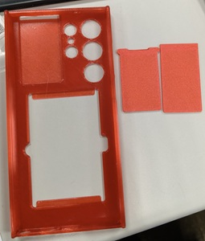
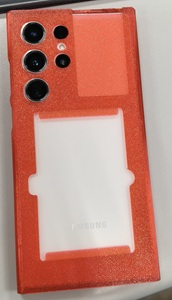
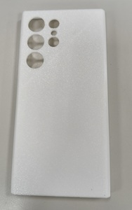
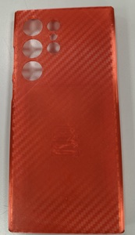
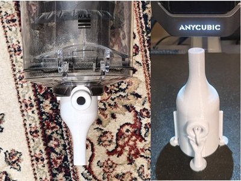

1. 裝飾太陽月亮臉+變色龍PEO
2. S23U 手機殼
3. 真空袋工具
4. 乾燥盒

---
## 🎡 251020 裝飾太陽月亮臉+變色龍PEO 碎碎唸

好一陣子沒印 A1m 更強了, 以往廢個半年沒印, 線材八成就捲了~ 
AMS Lite 妥妥的沒事, 現在只有烘乾過的線太脆, 不能放 AMS2 Pro, 不OK的線要先有拆機的心理準備, 就是變著花招各式各樣的堵~ 
H2D 開箱3天就五通也堵, 擠出機也堵, AMS2 也堵, 好在早就備妥2顆噴頭, 還有什麼能壞滴~ 
好像也只有黃銅噴頭能被磨壞, 去年開機第一天就印壞1顆噴頭, 要能把不锈鋼噴頭磨壞也太強了~

## 🎡 251026 S23U 手機殼 + 碳纖維PET 碎碎唸

透明 PLA 205℃ 稀疏填充 15/100 ~ 🧵紅色TPU Part II (H2D) 🧶白色TPU Part III (H2D) 🧶紅色TPU Part IV (A1m)

## 🎡 251226 真空袋工具

[戴森吸尘器真空袋适配器 V2](https://makerworld.com/zh/models/189462)
添加圓柱修改器 40x40x18mm X-Y-Z 1-3-9mm 稀疏填充20% 及可變層高 細節/速度 0.5->0.3 半徑 5->3 內層真的很細緻, 外牆差了些, 有了這個適配器, 就可以直接用 Dyson 抽真空快粉多, 小手泵不夠力要吸很久, 也不需要專用真空袋~

[真空袋抽气站](https://makerworld.com/zh/models/2130830)

## 🎡 乾燥盒