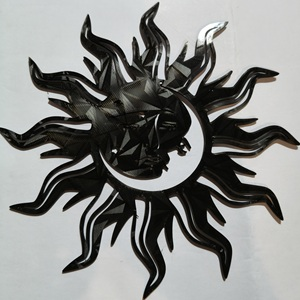

1. 裝飾太陽月亮臉+變色龍PEO

---
## 🎡 251020 裝飾太陽月亮臉+變色龍PEO 碎碎唸

好一陣子沒印 A1m 更強了, 以往廢個半年沒印, 線材八成就捲了~ 
AMS Lite 妥妥的沒事, 現在只有烘乾過的線太脆, 不能放 AMS2 Pro, 不OK的線要先有拆機的心理準備, 就是變著花招各式各樣的堵~ 
H2D 開箱3天就五通也堵, 擠出機也堵, AMS2 也堵, 好在早就備妥2顆噴頭, 還有什麼能壞滴~ 
好像也只有黃銅噴頭能被磨壞, 去年開機第一天就印壞1顆噴頭, 要能把不锈鋼噴頭磨壞也太強了~

## 🎡 251026 S23U 手機殼 + 碳纖維PET 碎碎唸

透明 PLA 205℃ 稀疏填充 15/100 ~ 🧵紅色TPU Part II (H2D) 🧶紅色TPU Part III (A1m)

