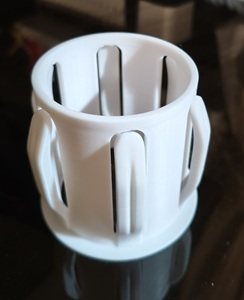

# 🎡 3DP Kits

🏯 Adapter 🏯 Spool 🏯 Filament 🏯 Tool

## 🏯 Adapter
🌟[参数化线轴适配器](https://makerworld.com/zh/models/495534)
[料卷转接环 65-80mm](https://makerworld.com/zh/models/627720)

## 🏯 Spool
[拓竹料盘](https://makerworld.com.cn/zh/models/125808)

## 🏯 Filament

好用滴填充色板与翻页色板盒 🌟[填充色板与翻页色板盒](https://makerworld.com/zh/models/659130)
超方便的線材色卡集 🌟 [Bambu 线材色卡 v2](https://makerworld.com/zh/models/95837)

## 🏯 Tool

* 很實用的热端套筒拆卸器, 拆硅胶必備。
  [A1 A1mini 热端套筒拆卸器](https://makerworld.com/zh/models/422022)
* 线夹是一定要印的。[线夹](https://makerworld.com/zh/models/96692)  
* 刮刀是範例模型, 不過PLA太軟, 一遇熱沒多久就破口了。

## 🏯 SUNLU FilaDryer S4
[SUNLU FilaDryer S4 支架](https://makerworld.com/zh/models/581222)

