# 🎡 3DP Kits

🏯 Spool 🏯 Spool Adapter 🏯 Filament Holder 🏯 Filament 🏯 Tool 🏯 Dryer 🏯 SUNLU

## 🏯 Spool
[拓竹料盘-1](https://makerworld.com.cn/zh/models/125808) 要對準紙捲的洞卡緊, 不然很容易側邊纒線~ 
[拓竹料盘-2](https://makerworld.com/zh/models/1149528)
[拓竹料盘-3](https://makerworld.com/zh/models/69170) 列印時間只要3hs, 雖然軟了點還是能用, 不過放 AMS Lite 很難拔~
[拓竹料盘-4](https://makerworld.com/zh/models/69170) 
[拓竹料盘-5](https://makerworld.com/zh/models/807070) 

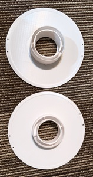
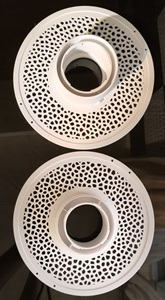

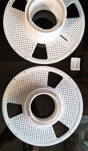
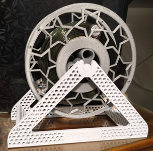

## 🏯 Spool Adapter
🌟[参数化线轴适配器](https://makerworld.com/zh/models/495534)
[花捲参数化线轴适配器](https://makerworld.com/zh/models/495534)
[料卷转接环 65-80mm](https://makerworld.com/zh/models/627720)

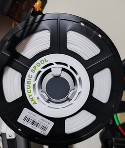
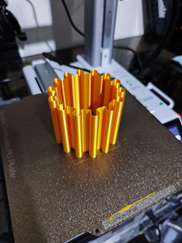

## 🏯 Filament Holder

[耗材料架](https://makerworld.com/zh/models/1728033) 滑順度比較不夠, 但還可用~

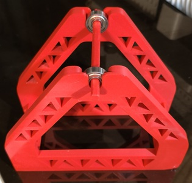

## 🏯 Filament

好用滴填充色板与翻页色板盒 🌟[填充色板与翻页色板盒](https://makerworld.com/zh/models/659130)
超方便的線材色卡集 🌟 [Bambu 线材色卡 v2](https://makerworld.com/zh/models/95837)

## 🏯 Tool

* 很實用的热端套筒拆卸器, 拆硅胶必備。
  [A1 A1mini 热端套筒拆卸器](https://makerworld.com/zh/models/422022)
* 线夹是一定要印的。[线夹](https://makerworld.com/zh/models/96692)  
* 刮刀是範例模型, 不過PLA太軟, 一遇熱沒多久就破口了。
* 換支可替換刮刀。[热床刮刀 XL](https://makerworld.com/zh/models/413220), [刮刀托盘](https://makerworld.com/zh/models/523675)
* [打印板清洁器](https://makerworld.com/zh/models/386963)

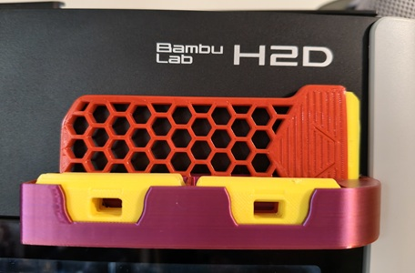

[线轴卷尺](https://makerworld.com/zh/models/1161927)

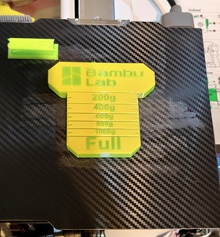

## 🏯 Dryer
[硅胶干燥盒 XL x9, Bambu x12](https://makerworld.com/zh/models/1193993) Bambu 47.27mm ~ 62mm 含温度計, XL60mm

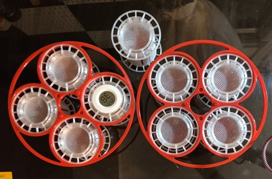
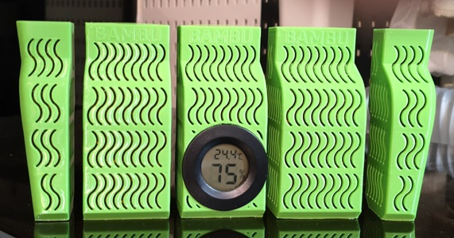

## 🏯 SUNLU 
[SUNLU FilaDryer S4 支架](https://makerworld.com/zh/models/581222)

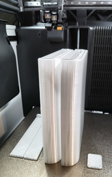
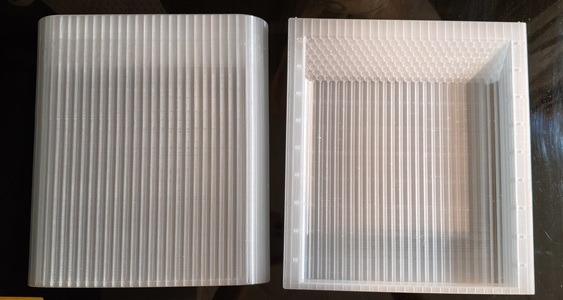
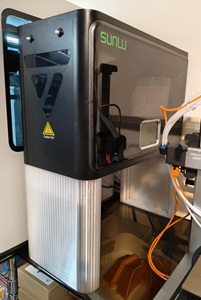

