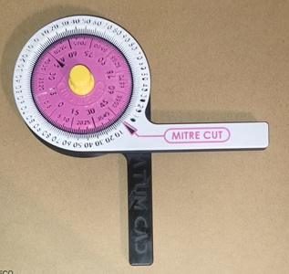
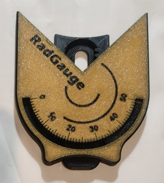

1. 量角器/半徑規/輪廓規/螺栓測量
2. 乾燥盒

---
## 🎡 260227 量角器/半徑規/輪廓規/螺栓測量

[量角器](https://makerworld.com/models/2084615)
[半径规 (RadGauge)](https://makerworld.com/zh/models/1504999)
[轮廓规](https://makerworld.com/models/1527333)
[螺栓螺母螺距测量工具 M1-M10](https://makerworld.com/zh/models/894027)

