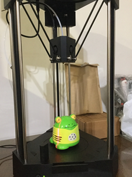
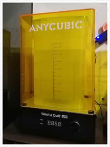
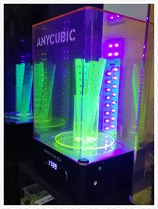
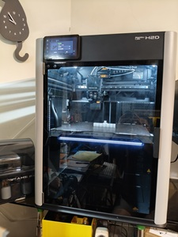

# 🎡 校正碎碎唸 | 
# 🎡 校正 | 🎡 切片

## 🎡 3DP 起手式

## 🎡 241010 校正碎碎唸
在排除萬難之後, 總算印出第1個溫度塔, Kobra3 還是印的美美滴, 跑線是鐵架不穩, 
附檔是 Kobra3 的 GCode, 因為 PrusaSlicer 的溫度塔切片, 無法在 Kobra3 列印, 
所以只好導出 Kobra3 的 GCode, 再手補溫度。

[Ellis' Print Tuning Guide](https://ellis3dp.com/Print-Tuning-Guide/)
[KobraGoNeo Insights - Calibration](https://1coderookie.github.io/KobraGoNeoInsights/calibration/)

1. PLA温度塔 210-220℃ 
([原STL](https://www.thingiverse.com/thing:2729076),
[Kobra3 PLA 180-225 GCode](./img/guide/SmartTemperatureTower_PLA_180-225.gcode))

| Bambu Studio 温度預覽粉漂亮,  可惜給看不給印。 還好有人搞出來了 [BambuLab A1 mini 温度塔](https://makerworld.com/zh/models/112623)  | AC壞了的噴嘴 印了個寂寞 發泡的温度塔, 只印了6層。  |
| ------- | ------- |
|  |  |
| AC 亮白色的最佳温度是200℃,  215℃以上會拉絲, 185℃以下沒有光澤,  190℃不小心關了電源, 續印效果也還行。| AC 螢光綠 最佳温度185℃ (原195-205) 正面不能看, 反面完美。  |
|  |   |

2. PETG温度塔 250-260℃

3. ABS温度塔  210-250℃
([Kobra3 ABS 200-250 GCode](./img/guide/SmartTemperatureTower_ABS_200-250.gcode))

| Anycubic Slicer Next 預覽 | 海螺号ABS  放了8年的線 | 元洋ABS+  |
| ------- | ------- | ------- |
|  | ------- | ------- |

4. TPU温度塔  210-230℃ 熱床80℃

| TPU 210-250℃ 熱床80℃  最佳温度勉強算205/210℃吧,  再往下就印空了, 往上拉絲嚴重,  為了印個溫度塔, 連擠出機都要拆, 真素粉麻煩。 不過有了準確值, 印出來的 TPU 就都美美滴, 不枉搞半天的拆機。  | A1 mini TPU 225℃ 比較透明不會發泡 但拉絲嚴重, 比較起來還是210℃好看。 | 
| ------- | ------- |
|  |  |

## 🎡 校正

## 🎡 切片

🖨️ [220608 Maker's Muse - Slicer defaults I ALWAYS change](https://www.youtube.com/watch?v=mE521Q4H6aY)
	3:08 Perimeters 4:52 Infill 6:58 Elephant Foot 8:44 Seam Placement 11:36 Ensure Vertical Shell Thickness