# 🎡 校正碎碎唸 | 🎡 Kobra3 指南 | 🎡 A1m 指南 | 🎡 AC Kobra 3 必印 | 🎡 Bambu A1 mini 必印

## 🎡 起手式
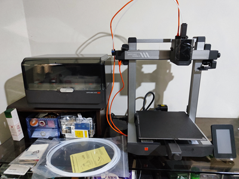
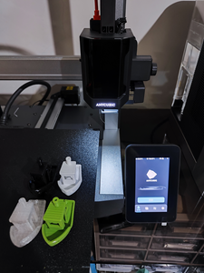

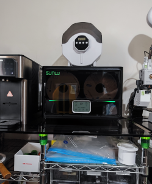

## 🎡 241010 校正碎碎唸
在排除萬難之後, 總算印出第1個溫度塔, Kobra3 還是印的美美滴, 跑線是鐵架不穩, 
附檔是 Kobra3 的 GCode, 因為 PrusaSlicer 的溫度塔切片, 無法在 Kobra3 列印, 
所以只好導出 Kobra3 的 GCode, 再手補溫度。

1. PLA温度塔 210-220℃ 
([原STL](https://www.thingiverse.com/thing:2729076),
[Kobra3 PLA 180-225 GCode](./img/guide/SmartTemperatureTower_PLA_180-225.gcode))

| Bambu Studio 温度預覽粉漂亮,  可惜給看不給印。 還好有人搞出來了 [BambuLab A1 mini 温度塔](https://makerworld.com/zh/models/112623)  | 壞了的噴嘴 印了個寂寞 發泡的温度塔, 只印了6層。  |
| ------- | ------- |
| 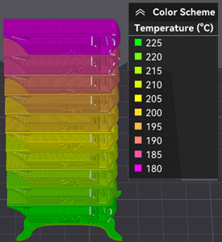 | 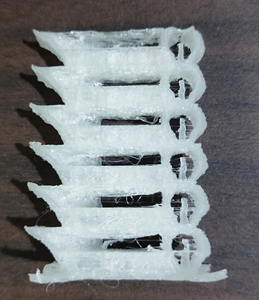 |
| AC 亮白色的最佳温度是200℃,  215℃以上會拉絲, 185℃以下沒有光澤,  190℃不小心關了電源, 續印效果也還行。| AC 螢光綠 最佳温度185℃ (原195-205) 正面不能看, 反面完美。  |
| 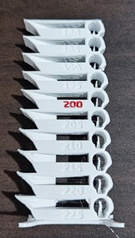 |   |

2. PETG温度塔 250-260℃

3. ABS温度塔  210-250℃
([Kobra3 ABS 200-250 GCode](./img/guide/SmartTemperatureTower_ABS_200-250.gcode))

| Anycubic Slicer Next 預覽 | 海螺号ABS  放了8年的線 | 元洋ABS+  |
| ------- | ------- | ------- |
| 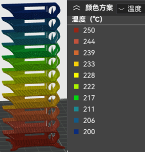 | ------- | ------- |

4. TPU温度塔  210-230℃ 熱床80℃

| TPU 210-250℃ 熱床80℃  最佳温度勉強算205/210℃吧,  再往下就印空了, 往上拉絲嚴重,  為了印個溫度塔, 連擠出機都要拆, 真素粉麻煩。 不過有了準確值, 印出來的 TPU 就都美美滴, 不枉搞半天的拆機。  | A1 mini TPU 225℃ 比較透明不會發泡 但拉絲嚴重, 比較起來還是210℃好看。 | 
| ------- | ------- |
| 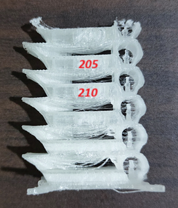 | 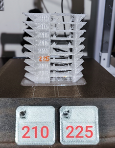 |

## 🎡 Kobra3 指南

## 🎡 A1m 指南 
[A1 mini](https://wiki.bambulab.com/zh/a1-mini/manual/intro-a1-mini), [AMS lite](https://wiki.bambulab.com/zh/ams-lite), [耗材指南](https://wiki.bambulab.com/zh/general/filament-guide-material-table)

[X1喷嘴/热端堵塞](https://wiki.bambulab.com/zh/x1/troubleshooting/nozzle-clog), [更換熱端](https://www.bilibili.com/video/BV1k94y1Q78W/?t=23.056378&spm_id_from=333.1350.jump_directly)

[TPU 打印建议](https://wiki.bambulab.com/zh/knowledge-sharing/tpu-printing-guide)

PLA-CF, PETG, ABS, PLA Marble/Sparkle/Glow 不要使用 0.2mm/不锈钢/黄铜 喷嘴, 首选 0.6mm 硬化钢喷嘴, 使用前将喷嘴设为 280℃, 用通针清洁喷嘴, 减少堵头风险。

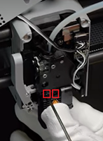

## 🎡 AC Kobra 3 必印

## 🎡 Bambu A1 mini 必印
🏯 支架 | 🏯 AMS | 🏯 收納 | 🏯 SPOOL | 🏯 Slicer | 🏯 工具

### 🏯 支架 
1. A1 mini 太輕, 鐵力士架不是很穩, 這個頂部安裝支架讓列印更穩, 跑線狀況少了很多。[A1 MINI AMS 10mm 更短的顶部安装支架](https://makerworld.com/zh/models/110341)
 
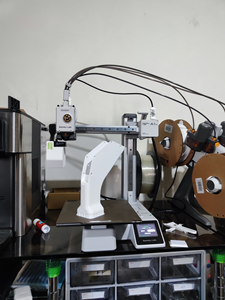
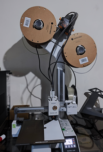

2. 雖然USB走線看起來還蠻堅固, 不過印個小件也花不了多少時間, 所以就當裝飾囉。
  [USB走线-左](https://makerworld.com/zh/models/447966)
3. 右側走線是一定要印的, 會跟AMS第2個進料打架。 [A1系列90度线缆支架v2](https://makerworld.com/zh/models/662704)
4. 🌟联轴器 [A1 & A1 Mini AMS 联轴器易修复适配器](https://makerworld.com/zh/models/505769)

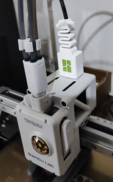
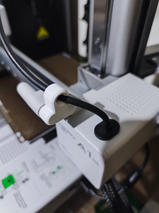
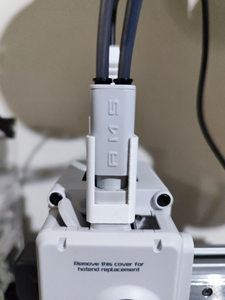

### 🏯 AMS

### 🏯 收納
* 很方便的屎盆

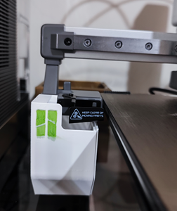

* 這個側盒是用 PLA 印的, 還是用 PETG 比較好, 側盒在列印時溫度頗高。
[A1 mini 侧盒](https://makerworld.com/zh/models/80945)

### 🏯 Slicer

好用滴填充色板与翻页色板盒 [填充色板与翻页色板盒](https://makerworld.com/zh/models/659130)

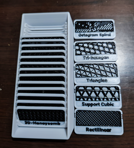

### 🏯 SPOOL
[参数化线轴适配器](https://makerworld.com/zh/models/495534)

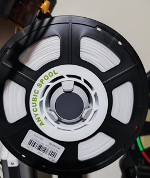
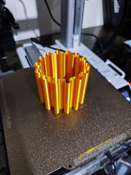

### 🏯 工具

* 很實用的热端套筒拆卸器, 拆硅胶必備。
  [A1 A1mini 热端套筒拆卸器](https://makerworld.com/zh/models/422022)
* 线夹是一定要印的。[线夹](https://makerworld.com/zh/models/96692)  
* 刮刀是範例模型, 不過PLA太軟, 一遇熱沒多久就破口了。

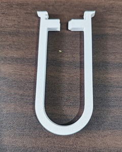
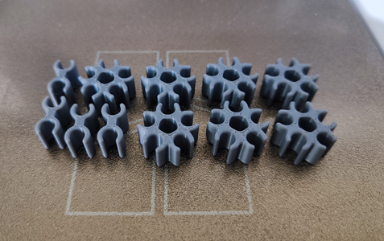
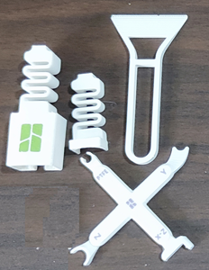