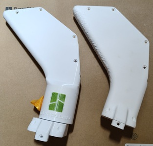
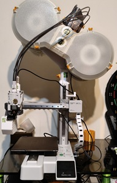

# MyBambu A1m

🎡 A1m 指南 | 🎡 Bambu A1 mini 必印

## 🎡 A1m 指南 
📚[A1 mini](https://wiki.bambulab.com/zh/a1-mini/manual/intro-a1-mini), 📚 [AMS lite](https://wiki.bambulab.com/zh/ams-lite), 📚 [耗材指南](https://wiki.bambulab.com/zh/general/filament-guide-material-table)

🎵 [五通修理](https://www.youtube.com/watch?v=hmByMHddxLE)/
📚 [擠出機堵塞](https://wiki.anycubic.com/zh/fdm-3d-printer/kobra-3-combo/extruder-replacement) 🎵 [擠出機視頻](https://www.youtube.com/watch?v=CLlT1RV-oJE)
🎵 [X1喷嘴/热端堵塞](https://wiki.bambulab.com/zh/x1/troubleshooting/nozzle-clog), 🎵[更換熱端](https://www.bilibili.com/video/BV1k94y1Q78W)
🎵 [熱端堵頭](https://www.youtube.com/watch?v=-bYwgUPOIq8)
🎵 [Z上油](https://www.youtube.com/watch?v=SUs5zoRwFjw)

📚 [TPU 打印建议](https://wiki.bambulab.com/zh/knowledge-sharing/tpu-printing-guide)

PLA-CF, PETG, ABS, PLA Marble/Sparkle/Glow 不要使用 0.2mm/不锈钢/黄铜 喷嘴, 首选 0.6mm 硬化钢喷嘴, 使用前将喷嘴设为 280℃, 用通针清洁喷嘴, 减少堵头风险。

---
## 🎡 Bambu A1 mini 必印

🏯 支架 | 🏯 AMS | 🏯 SPOOL | 🏯 Slicer | 🏯 收納 | 🏯 工具

### 🏯 支架 

1. 251105 換了 [可旋转顶部支架](https://makerworld.com/zh/models/845479) , 方便多了~ H2D 列印品質有比較好, 列印高物件還是要在密閉空間, 會比較穩定~ 低物件 A1m 感覺上還是比較穩, 剛上手 H2D 時真有給嗆到, 還好經過各種炒麵、堵頭、堵AMS, 近二個禮拜悲情的手動上料, 拆機之後還會鬧脾氣, 竟要重設AMS, 好在最後還是給摸順了~ XD~

1. 241006 A1 mini 太輕, 鐵力士架不是很穩, 這個頂部安裝支架讓列印更穩, 跑線狀況少了很多。🌟[A1 MINI AMS 10mm 更短的顶部安装支架](https://makerworld.com/zh/models/110341)
 

2. 雖然USB走線看起來還蠻堅固, 不過印個小件也花不了多少時間, 所以就當裝飾囉。
  [USB走线-左](https://makerworld.com/zh/models/447966)
3. 右側走線是一定要印的, 會跟AMS第2個進料打架。 🌟[A1系列90度线缆支架v2](https://makerworld.com/zh/models/662704)
4. 联轴器 🌟[A1 & A1 Mini AMS 联轴器易修复适配器](https://makerworld.com/zh/models/505769)

---
### 🏯 AMS Lite

1. 251107 終於把 [终极线轴密封箱——01型](https://makerworld.com/zh/models/486153) 給印上, 不用再裸奔了~

