# 🎋 Bambu A1M

🎡 A1M 指南 | 換裝 | 🎡 Bambu A1 mini 必印

## 🎡 A1M 指南 
📚 [A1 mini](https://wiki.bambulab.com/zh/a1-mini/manual/intro-a1-mini), 📚 [AMS lite](https://wiki.bambulab.com/zh/ams-lite), 📚 [耗材指南](https://wiki.bambulab.com/zh/general/filament-guide-material-table)

🎵 [五通修理](https://www.youtube.com/watch?v=hmByMHddxLE)/
📚 [擠出機堵塞](https://wiki.anycubic.com/zh/fdm-3d-printer/kobra-3-combo/extruder-replacement) 📚🌟 [挤出模块组件拆装指引](https://wiki.bambulab.com/zh/a1-mini/maintenance/a1-extruder) 🎵 [挤出模块拆装](https://www.bilibili.com/video/BV1UN4y1S7y9) 🎵 [擠出機視頻](https://www.youtube.com/watch?v=CLlT1RV-oJE)
🎵 [X1喷嘴/热端堵塞](https://wiki.bambulab.com/zh/x1/troubleshooting/nozzle-clog), 🎵[更換熱端](https://www.bilibili.com/video/BV1k94y1Q78W)
🎵 [熱端堵頭](https://www.youtube.com/watch?v=-bYwgUPOIq8)
🎵 [Z上油](https://www.youtube.com/watch?v=SUs5zoRwFjw)

📚 [TPU 打印建议](https://wiki.bambulab.com/zh/knowledge-sharing/tpu-printing-guide)

PLA-CF, PETG, ABS, PLA Marble/Sparkle/Glow 不要使用 0.2mm/不锈钢/黄铜 喷嘴, 首选 0.6mm 硬化钢喷嘴, 使用前将喷嘴设为 280℃, 用通针清洁喷嘴, 减少堵头风险。

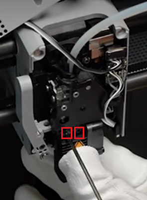
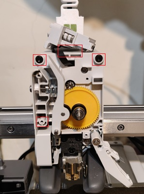

## 🎡 A1M 換裝 

260228 [更换部件冷却风扇](https://wiki.bambulab.com/zh/a1-mini/maintenance/part-cooling-fan)

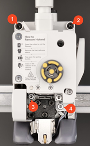

260305 單純換心情~
[Panda Knomi 3D Wiki](https://global.bttwiki.com/Panda_Knomi_3D.html#connect-panda-knomi-3d-to-the-same-wi-fi-as-the-printer), [熊猫Knomi显示屏上翻盖A1系列](https://makerworld.com/zh/models/1317500)
Panda Juicer 硬化刚喷嘴/冰川/凍傷冷打板, 粉貴好用~

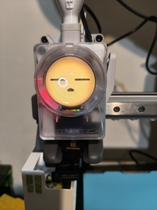
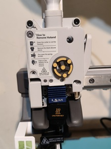

---
## 🎡 Bambu A1 mini 必印

🏯 六通 🏯 分流器 🏯 支架 🏯 AMS Lite/工具 🏯 收納 

### 🏯 六通 

- 251214 原本用 [Y型分线器](https://makerworld.com/zh/models/938395) 接外掛料架, 不過退線時 PTFE 也跟著脫落, 又不能黏死很是麻煩, 所以又換成 [六通](https://makerworld.com/zh/models/1310652) ~ 

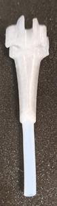
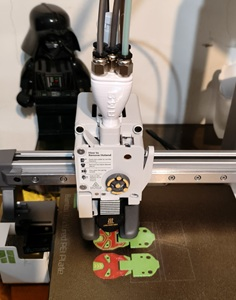

### 🏯 分流器 
🌟[顺滑 Y 分流器连接器](https://makerworld.com/zh/models/18174) 和 [Smoothy 支架](https://makerworld.com/zh/models/18190)

### 🏯 支架 

- 251105 換了 🌟[可旋转顶部支架](https://makerworld.com/zh/models/845479) , 方便多了~ H2D 列印品質有比較好, 列印高物件還是要在密閉空間, 會比較穩定~ 低物件 A1M 感覺上還是比較穩, 剛上手 H2D 時真有給嗆到, 還好經過各種炒麵、各種堵頭、堵AMS, 近二個禮拜悲情的手動上料, 該拆的都拆過了, 沒想到拆機之後還會鬧脾氣, 竟然要重設AMS, 好在最後還是給摸順了~ XD~

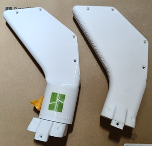

- 241006 A1 mini 太輕, 鐵力士架不是很穩, 這個頂部安裝支架讓列印更穩, 跑線狀況少了很多。🌟[A1 MINI AMS 10mm 更短的顶部安装支架](https://makerworld.com/zh/models/110341)
 
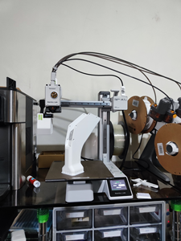
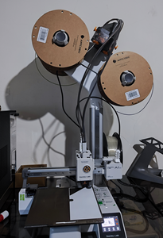

### 🏯 AMS Lite/工具

- 251107 終於把 🌟[终极线轴密封箱——01型](https://makerworld.com/zh/models/486153) 給印上, 不用再裸奔了~

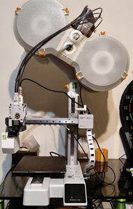

---
1. 雖然USB走線看起來還蠻堅固, 不過印個小件也花不了多少時間, 所以就當裝飾囉。
  [USB走线-左](https://makerworld.com/zh/models/447966)
1. 右側走線是一定要印的, 會跟AMS第2個進料打架。 🌟[A1系列90度线缆支架v2](https://makerworld.com/zh/models/662704)

2. 联轴器 🌟[A1 & A1 Mini AMS 联轴器易修复适配器](https://makerworld.com/zh/models/505769)

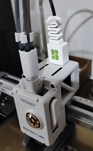
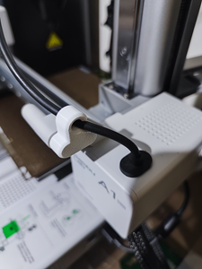
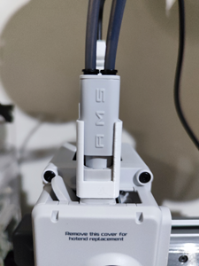

[一体打印侧拉链](https://makerworld.com/zh/models/835521)

### 🏯 收納
* 很方便的屎盆

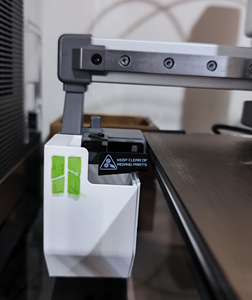

* 這個側盒是用 PLA 印的, 還是用 PETG 比較好, 側盒在列印時溫度頗高。
[A1 mini 侧盒](https://makerworld.com/zh/models/80945)

---

