# 🎋 Bambu H2D

	Single: 325*320*325mm  Double: 300*320*325mm
	Max Nozzle Temp: 350°C Bed: 120°C Chamber: 65°C
	Size: 492*514*626 31kg 
	左熱端不可印TPU, AMS2 不可印低於95A 

---
## 🧱 [H2D wiki](https://wiki.bambulab.com/zh/h2d)
♨ BambuStudio https://github.com/bambulab/BambuStudio

📚 [疏通热端](https://www.bilibili.com/video/BV1aX4y1L76J)
📚 [更换热端](https://wiki.bambulab.com/zh/h2/maintenance/replace-hotend)
📚 [挤出机堵塞](https://wiki.bambulab.com/zh/x1/troubleshooting/extruder-clog)
    🎵[挤出机堵料清理](https://www.bilibili.com/video/BV1XP411H7CR)
📚 [热床手动调平](https://wiki.bambulab.com/zh/h2/manual-bed-leveling)
🎵🌟 [AMS 2 Pro 拆装指南](https://www.bilibili.com/video/BV1R3f3Y3EGW)
📚 [检测电路](https://wiki.bambulab.com/zh/knowledge-sharing/multimeter)
    [故障排查建议](https://wiki.bambulab.com/zh/general/tripping-and-electric-issue)

📚 [高温耗材、工程材料](https://wiki.bambulab.com/zh/knowledge-sharing/pa-cf-printing-tips)
    [耗材指南](https://wiki.bambulab.com/zh/general/filament-guide-material-table)
    [软硬混打](https://wiki.bambulab.com/zh/h2/manual/soft-and-hard-filament-multi-material-printing-guide77)
    [TPU 打印建议](https://wiki.bambulab.com/zh/knowledge-sharing/tpu-printing-guide)
    [H2 TPU85A/90A 打印指南](https://wiki.bambulab.com/zh/h2/h2d-tpu-printing-guide)
    [透明/半透明 PLA/PETG 耗材打印指南](https://wiki.bambulab.com/zh/knowledge-sharing/transparent-petg)
    [材料收缩与轴孔补偿](https://wiki.bambulab.com/zh/knowledge-sharing/3d-prints-shrinkage)

📚 [动态流量校准](https://wiki.bambulab.com/zh/software/bambu-studio/calibration_pa)
📚 [刀切模组](https://wiki.bambulab.com/zh/h2/manual/cutter-setup)
    [刀切模组辅助工具](https://wiki.bambulab.com/zh/h2/manual/cutting-module-assist-tool)
    [刀切模组材料介绍](https://wiki.bambulab.com/zh/h2/blade-cutter/material/types-and-examples-intro)
    

---
## 🎡 Bambu H2D 必印

🖨️ 增高架 🏯 工具

### 🖨️ 增高架
[H2D AMS增高架](https://makerworld.com/zh/models/1670171)
超瘋狂的增高架 4447g 列印 10d2h33m 起, 還好1111補了超多線~

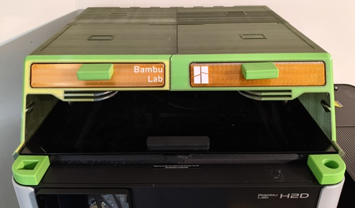

PETG 
去年的線和今年的線色差頗大, 還好是從後面開始印, 從前面看不太出來~ 
可能是連續列印了近10天, AMS 換色時, 竟然瘋了進退線不得一直空轉, 1號盒就卡在換色最後一里路, 還好停機1天重新開機就好了, 不過又發生另一個問題, 停機太久底座就分離了, 底座移位就很難救了, 只好重印~ 第二次列印又因為擦拭搭移位, 所以只好一直炒麵下去, 最後才發現斜面換色無聊的很, 底邊也沒熨燙不好看, 換料幾乎是 1:20 產生一大堆廢料和炒麵, 印右邊的時候就只用二色, 廢料少些 (根本沒換色還是耗了很多廢料, 這雙噴頭有點噱頭
), 不過擦拭搭還是移位了, 好在有先見之明, 早就用大膠帶牢牢固定擦拭搭和底座, 炒麵也沒能把擦拭搭炒移位, 勉強印到最後~

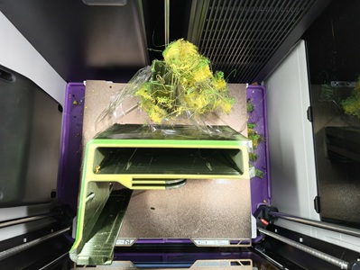
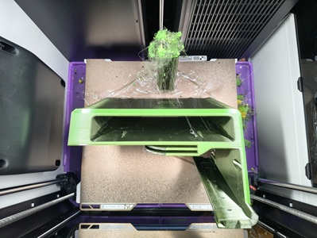
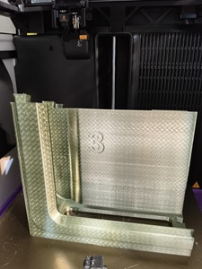
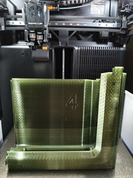

為了省料把擦拭塔填充間隙改成 300, 右邊盒子列印正常, 左邊盒子擦拭塔連印二次都炒麵了, 最後因為線不夠了不想再重來一次, 
就硬是從2/3處把炒麵給炒完, 不停地剪屎, 也有可能是 PETG 太滑黏不住, Brim 開的不夠, 結果料沒省到又多粍了100g, 最後線不夠了, 用透明線頂著, 還好不突兀。

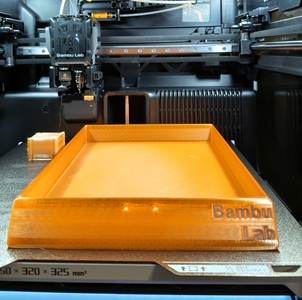
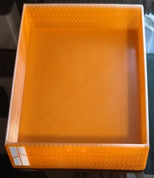
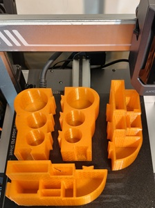

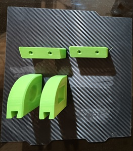

PA6-CF 收縮很厲害~

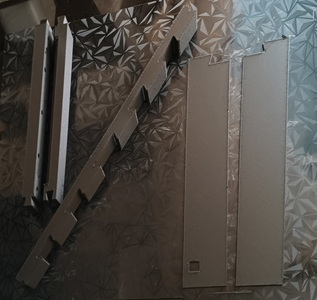
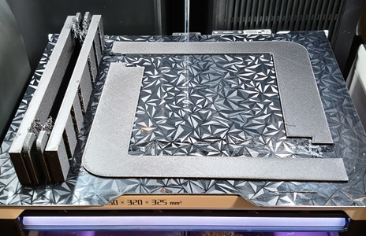

TPU 用左噴嘴印TPU要有拆擠出機的心理準備, 至於列印品質左右沒差, 反而覺得裝在左邊比裝右噴嘴方便, 右噴嘴可以留給分色用, 95A可以直接走緩沖機, 再軟些的線擠出機拉力會不夠, 用上置掛架會比較好~ 

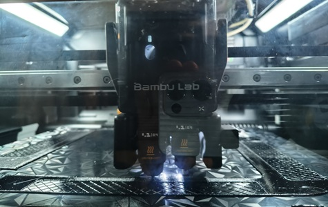
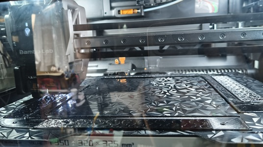

原廠的 TPU 配置牽絲嚴重疙瘩多, MakerWold 不少TPU配置都不錯, [完美打印TPU](https://makerworld.com/models/1602883) 4h47m, [高速TPU打印](https://makerworld.com/zh/models/476147) 2h30m 感覺上列印品質有比完美列印好些, 疙瘩少些~

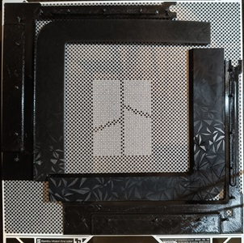

PLA 窗框~

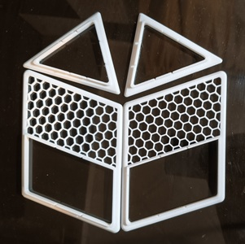

### 🏯 工具
* PETG [H2D 空气过滤器](https://makerworld.com/zh/models/1337864)
* PETG [H2D 托盘](https://makerworld.com/zh/models/1872548)
* PETG [H2D 轴润滑](https://makerworld.com/zh/models/1783548)
  
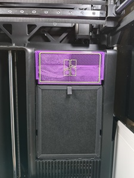
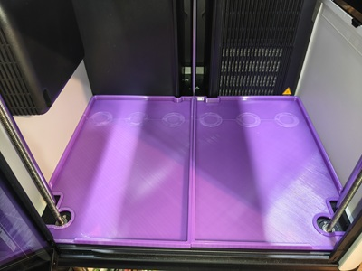
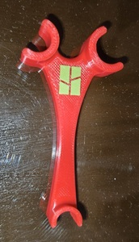

* [USB防尘塞](https://makerworld.com/zh/models/1929413)

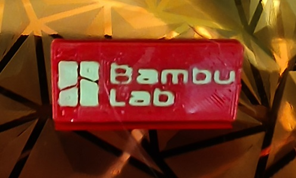

---

