# 🎋 Bambu H2D

	Single: 325*320*325mm  Double: 300*320*325mm
	Max Nozzle Temp: 350°C Bed: 120°C Chamber: 65°C
	Size: 492*514*626 31kg 
	左熱端不可印TPU, AMS2 不可印低於95A 

---
## 🧱 [H2D wiki](https://wiki.bambulab.com/zh/h2d)
♨ BambuStudio https://github.com/bambulab/BambuStudio

📚 [疏通热端](https://www.bilibili.com/video/BV1aX4y1L76J)
📚 [更换热端](https://wiki.bambulab.com/zh/h2/maintenance/replace-hotend)
📚 [挤出机堵塞](https://wiki.bambulab.com/zh/x1/troubleshooting/extruder-clog)
    🎵[挤出机堵料清理](https://www.bilibili.com/video/BV1XP411H7CR)
📚 [热床手动调平](https://wiki.bambulab.com/zh/h2/manual-bed-leveling)
🎵🌟 [AMS 2 Pro 拆装指南](https://www.bilibili.com/video/BV1R3f3Y3EGW)
📚 [检测电路](https://wiki.bambulab.com/zh/knowledge-sharing/multimeter)
    [故障排查建议](https://wiki.bambulab.com/zh/general/tripping-and-electric-issue)

📚 [高温耗材、工程材料](https://wiki.bambulab.com/zh/knowledge-sharing/pa-cf-printing-tips)
    [耗材指南](https://wiki.bambulab.com/zh/general/filament-guide-material-table)
    [软硬混打](https://wiki.bambulab.com/zh/h2/manual/soft-and-hard-filament-multi-material-printing-guide77)
    [TPU 打印建议](https://wiki.bambulab.com/zh/knowledge-sharing/tpu-printing-guide)
    [H2 TPU85A/90A 打印指南](https://wiki.bambulab.com/zh/h2/h2d-tpu-printing-guide)
    [透明/半透明 PLA/PETG 耗材打印指南](https://wiki.bambulab.com/zh/knowledge-sharing/transparent-petg)
    [材料收缩与轴孔补偿](https://wiki.bambulab.com/zh/knowledge-sharing/3d-prints-shrinkage)

📚 [动态流量校准](https://wiki.bambulab.com/zh/software/bambu-studio/calibration_pa)
📚 [刀切模组](https://wiki.bambulab.com/zh/h2/manual/cutter-setup)
    [刀切模组辅助工具](https://wiki.bambulab.com/zh/h2/manual/cutting-module-assist-tool)
    [刀切模组材料介绍](https://wiki.bambulab.com/zh/h2/blade-cutter/material/types-and-examples-intro)
    

---
## 🎡 Bambu H2D 必印

🖨️ 增高架 🏯 工具 🏯 減震腳 🏯 AMS

### 🖨️ 增高架
251225 [H2D AMS增高架](https://makerworld.com/zh/models/1670171)
超瘋狂的增高架 4447g 列印 10d2h33m 起, 還好1111補了超多線~ XD~
雖然雷點很多, 最後成果還是很不錯, 不完美的部分就再說囉~

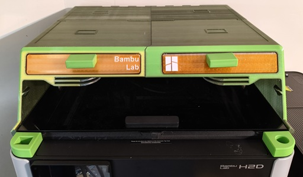

☘️PETG☘️ 
去年的線和今年的線色差頗大, 還好是從後面開始印, 從前面看不太出來~ 
可能是連續列印了近10天, AMS 換色時, 竟然瘋了進退線不得一直空轉, 1號盒就卡在換色最後一里路, 還好停機1天重新開機就好了, 不過又發生另一個問題, 停機太久底座就分離了, 底座移位就很難救了, 只好重印~ 第二次列印又因為擦拭搭移位, 所以只好一陸炒麵下去, 最後才發現斜面換色無聊的很, 頂邊沒熨燙也不好看, 就為了一點點換色, 換料幾乎是 1:20 產生一大堆廢料和炒麵, 印右邊的時候就只用二色, 廢料也就少些 (根本沒換色還是耗了很多廢料, 這雙噴頭有點噱頭 換心酸滴), 不過換色時擦拭搭還是移位了, 好在有先見之明, 早早就用大膠帶牢牢固定擦拭搭和底座 (若擦拭搭已經移位, 再貼大膠帶就沒用啦, 就只能將高層擦拭搭移除, 用炒麵換取繼續列印), 換色時炒麵也沒能把擦拭搭炒移位了, 大膠帶實在是太給力了, 也就勉勉強強印到最後~

這增高架印完, AMS 又瘋了, 可能是太操了, 原本只有4號線進不了, 現在是全部進不了線, 說是有堵料, 全部手動通線都好的啊, 如果有堵料連手動進料都過不了, 就這樣手動進料 AMS 又自己給退回去了, 然後把線咬的都是齒痕, 明明就已經進到擠出機了, 不曉得那個偵測器太過敏感, 只好等有空再來拆機了, 這都不曉得瘋幾次了~

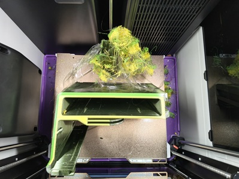
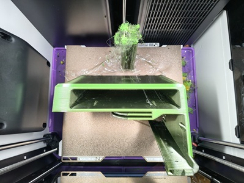
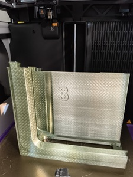
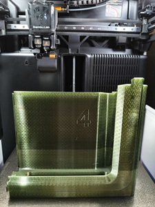

為了省料把擦拭塔填充間隙改成 300, 右邊盒子列印正常, 左邊盒子擦拭塔連印二次都炒麵了, 最後因為線不夠了不想再重來一次, 
就硬是從2/3處把炒麵給炒完, 不停地剪屎, 也有可能是 PETG 太滑黏不住, Brim 開的不夠, 結果料沒省到又多粍了100g, 最後線不夠了, 用透明線頂著, 還好不突兀。

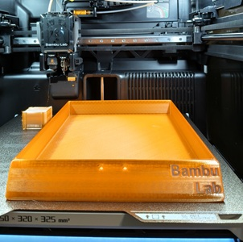
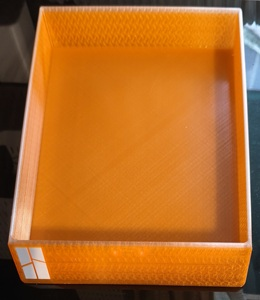
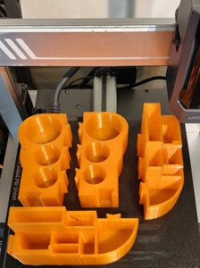

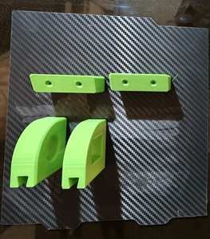

☘️PA6-CF☘️ 收縮很厲害~ 只有橫桿能用, 其他都接不上~

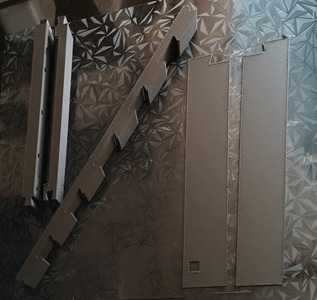
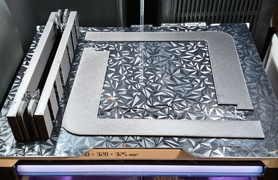

☘️TPU☘️ 用左噴嘴印TPU要有拆擠出機的心理準備, 如果出現擠出電機過載, 為擠出機拉力不夠, 用上置料架或直接供料可以改善供料順暢度, 如果出現擠出機堵塞, 先冷拔剪掉前段料頭, 然後用一段PETG線將將殘料擠出, 再重新進料即可, 似乎是續印時料頭因為高溫變粗了, 擠出機推不動 問題不大, TPU 比較柔韌比較不會出現斷料的慘況~ 至於列印品質左右沒差, 反而覺得裝在左邊比裝右噴嘴方便, 右噴嘴可以留給分色用, 95A可以直接走緩沖機, 再軟些的線擠出機拉力會不夠, 用上置掛架會比較好~ 

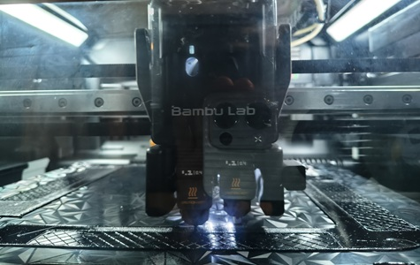
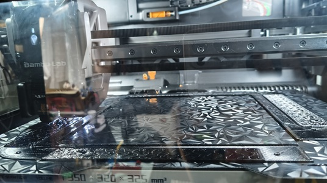

原廠的 TPU 配置牽絲嚴重疙瘩多, MakerWold 不少TPU配置都不錯, [完美打印TPU](https://makerworld.com/models/1602883) 4h47m, [高速TPU打印](https://makerworld.com/zh/models/476147) 2h30m 感覺上列印品質有比完美列印好些, 疙瘩少些~

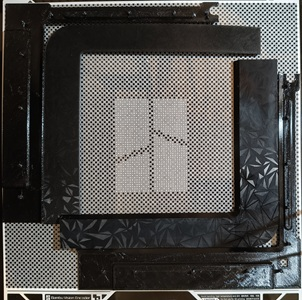

☘️PLA☘️ 窗框~

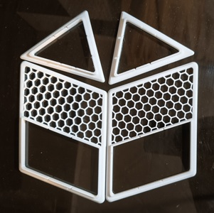

### 🏯 工具
* 251028 PETG [大型开放式废料斜槽](https://makerworld.com/zh/models/1316012)
  沒大磁鐵 自封磁鐵, 外圓 18x5mm 挖空 12.14x4.5mm, 實際磁鐵 12x3.63mm, 公差約97.52%, 最後一層封頂前設暫停放磁鐵~ 
  
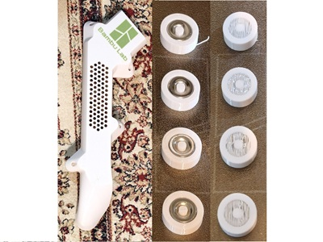

* 251125 PETG [H2D 空气过滤器](https://makerworld.com/zh/models/1337864)
* 251126 PETG [H2D 托盘](https://makerworld.com/zh/models/1872548)
* 251123 PETG [H2D 轴润滑](https://makerworld.com/zh/models/1783548)
  
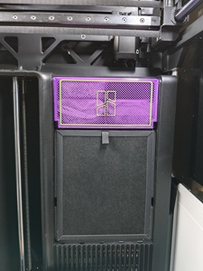
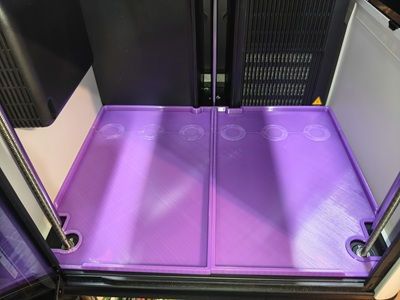
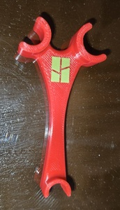

* [USB防尘塞](https://makerworld.com/zh/models/1929413)

---
### 🏯 減震腳

[HULA H2D减震底座](https://makerworld.com/models/1652209)
260201 H2D 太重, 滾珠減震腳不是太穩定, 所以換了個比較穩定的減震底座~ 
51202 15*32*12 培林x6 $228
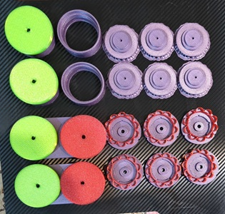
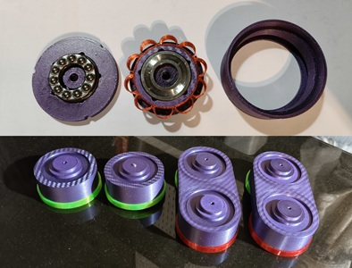
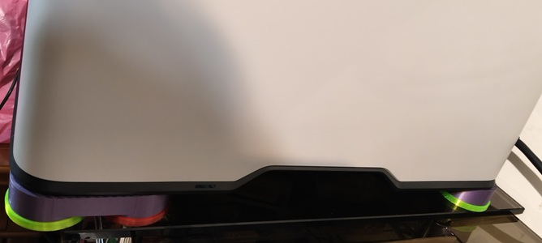

[减震块](https://makerworld.com/zh/models/1707194) 
251227 A1M 減震腳, H2D 減震腳 
原本只有滾珠用 TPU 列印, 剛好遇上 1227 宜蘭外海7.0地震, PETG 太滑, 還好沒把 A1M 摔下桌, 就全部用 TPU 印了~ 

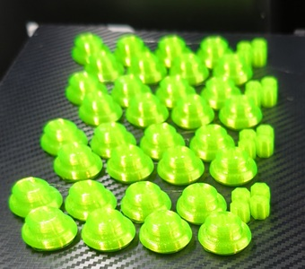
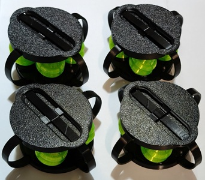
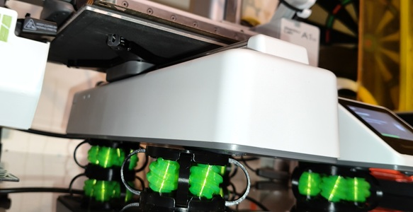

---
### 🏯 AMS

避免纒線好工具, 三套 AMS/ACE Saver~ 幾捲 AC 的線都纒了, 只要一纒線似乎就沒什麼救了, 解開之後沒多久又繼續纒了, 就這樣反覆解線纒線解線纒線解線纒線, 到用完為止~
[AMS超级除尘导向器保护器耗材助手 5x3mm](https://makerworld.com/zh/models/372977), 
[AMS 2 Pro 保护器](https://makerworld.com/zh/models/1527515)

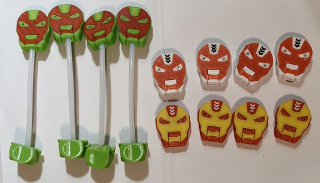
