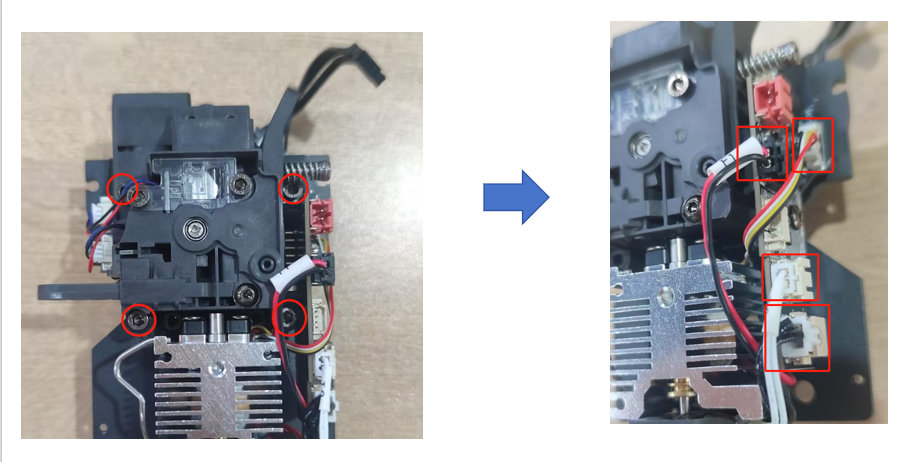
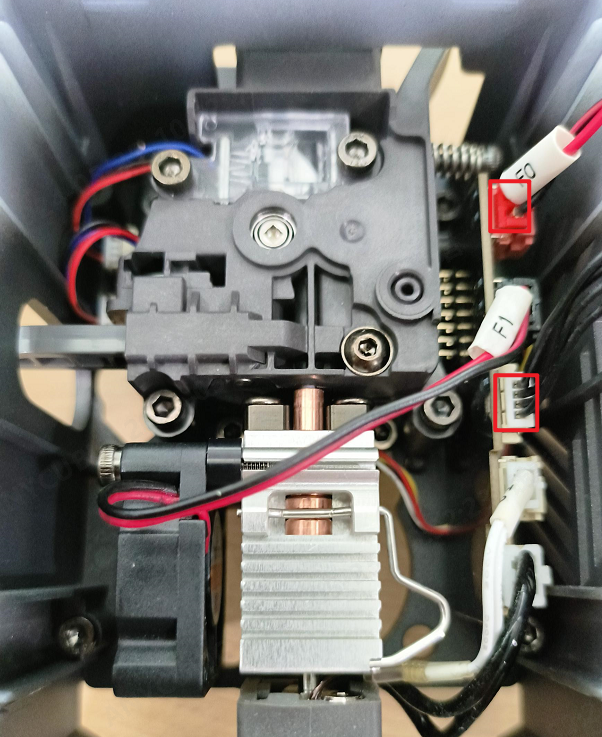

# 🎡 Kobra3 指南

---
📚[堵料檢測](https://cn.anycubic.com/upload/default/20240701/5ae0aebd133fc3ba4b03adc67c0ccf99.mp4)
| 📚 [打印头断料检测板](https://wiki.anycubic.com/zh/fdm-3d-printer/kobra-3-combo/material-break-detection-board-replacement-guide)
| 📚 [挤出机更换](https://wiki.anycubic.com/zh/fdm-3d-printer/kobra-3-combo/extruder-replacement)
| 📚 [切刀更换](https://wiki.anycubic.com/zh/fdm-3d-printer/kobra-3-combo/cutter-replacement)
| 📚 [ACE Pro主板更换](https://wiki.anycubic.com/zh/fdm-3d-printer/kobra-3-combo/ace-pro-mainboard-replacement-guide)
| 📚 [电机更换](https://wiki.anycubic.com/zh/fdm-3d-printer/kobra-3-combo/ace-pro-motor-replacement-guide)

 噴嘴螺絲在前

---
## 🎡 AC Kobra 3 必印

